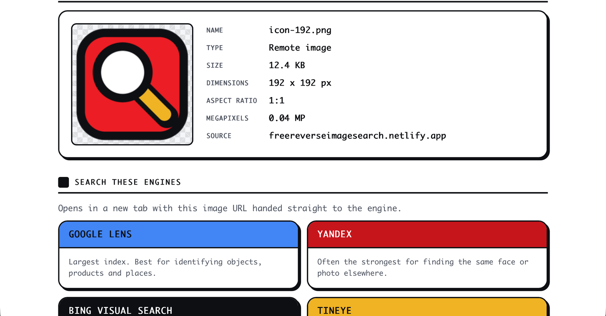

# Free Reverse Image Search

**[Try it: freereverseimagesearch.netlify.app](https://freereverseimagesearch.netlify.app)**

Search one image across Google Lens, Yandex, Bing and TinEye at once, read the EXIF and GPS
data hidden in the file, and fingerprint it with three perceptual hashes.

Free, no account, no ads, and **nothing is uploaded**. The whole tool is one HTML file that
does its work in your browser. That claim is the reason this repo exists: you can read the
file yourself and confirm there is no upload path, which is not something a hosted tool can
offer you.



- One file, no build step, no dependencies, no server
- EXIF parsed from raw bytes with no library, including GPS to decimal
- aHash, dHash and pHash, including a hand-rolled DCT
- Flags two things worth knowing about a photo: whether it carries location, and whether it
  was last saved by editing software rather than a camera

## What it does

- **Multi-engine search.** Hands one image to Google Lens, Yandex, Bing Visual Search
  and TinEye in one click.
- **EXIF extraction.** Camera, lens, timestamps, editing software, and GPS coordinates,
  parsed from the raw bytes with no library. Works for local files, and for remote URLs
  whose host allows cross-origin reads.
- **Perceptual hashing.** aHash, dHash and pHash, computed in-page, so you can tell
  whether two images are the same picture even after resizing or recompression.

## The design constraint that shaped everything

Reverse image search engines have to be able to **fetch the image themselves**. That
splits the problem in two:

- **An image already on the web** has a URL, so it can be handed straight to all four
  engines. This path works completely.
- **A file on your computer** has no public address. The usual solution is to upload it
  to a server so the engines can reach it, which means hosting costs, storage, and
  responsibility for whatever strangers upload. This tool refuses that trade: it copies
  the image to your clipboard so you can paste it into the engine yourself.

That choice is why there is no backend, no database, no bill, and no moderation problem.

## What it cannot do

It does not have its own image index, so it cannot answer "where else does this appear"
on its own. That capability belongs to Google, Yandex and TinEye, who spent 15+ years and
many millions building crawled indexes of billions of images. This tool is a good front
end to theirs, plus analysis they don't give you.

## Design

Monaco throughout at a 20px base, heavy black rules, `4px 4px 0` offset shadows with no
blur. Buttons and tiles physically depress on click: the element translates down-right and
the shadow collapses to zero.

Marvel carries the palette. The wordmark is reversed out of a solid red plate the way a
comic masthead is, red and black do the structural work, and gold is the second accent.
Exactly one Google color survives, on the one tile that is actually Google.

| Token | Hex | Paired with | Contrast | Used for |
|---|---|---|---:|---|
| `--hero` | `#EC1D24` | flat blocks only | n/a | section chips, accents |
| `--hero-ink` | `#C7151C` | white | 5.91:1 | masthead plate, primary button, Yandex tile |
| `--gold` | `#F0B323` | black | 10.21:1 | TinEye tile, edited flag |
| `--ink` | `#0d0f13` | white | 19.18:1 | Bing tile, privacy badge |
| `--g-blue` | `#4285F4` | black | 5.38:1 | Google Lens tile, location flag |

Rules that came out of measuring rather than guessing:

- **Marvel red `#EC1D24` fails against both white and black** (4.40:1 and 4.35:1), because
  it sits at mid luminance. It is only ever used as a flat block with no text on it. Every
  text-bearing red surface uses `--hero-ink` at `#C7151C`, which clears 4.5:1 on white.
- **Nameplates carry their own text color.** They are no longer all light, so each engine
  declares an `ink` alongside its `tile` and every pairing was checked to at least 4.5:1.
- Gold on red is 3.15:1, which only clears the bar for large bold text. It is used for one
  word in the 35px masthead and nowhere else.

### Favicon

A magnifier on a Marvel red plate: white lens, gold handle, everything inked in black
like the rest of the UI. Three decisions came from testing it at real size rather than
admiring it large:

- **The lens is a solid disc, not a ring.** A ring fills in and turns to mush at 16px.
- **The gold handle has a black under-stroke.** Gold on red is 3.15:1, so without the
  ink separating them the handle blurs into the plate at small sizes.
- **An image-frame concept was rejected outright.** It read fine at 128px and became an
  unidentifiable smudge at 16px.

Source is `favicon.svg`; it is also inlined into `index.html` as a data URI so the tool
stays a single self-contained file.

### On a phone

Tested at 393px. Three things needed fixing that only showed up at that width:

- The engine grid used `minmax(400px, 1fr)`, which holds a 400px track even in a
  345px container, so the tiles overflowed and were silently clipped by the
  `overflow-x: hidden` guard. Now `minmax(min(400px, 100%), 1fr)`.
- `word-break: break-all` on table values is right for a 16-character hash and wrong
  for "TestCam Industries". Now `overflow-wrap: anywhere`, which prefers spaces and
  only breaks inside a word when it has to.
- Below 560px the key/value tables stack, label above value, both full width. The
  nowrap label column was otherwise taking most of the screen.

Color blocks keep their exact hue in dark mode, the way ink on a printed page would. Only
the surfaces around them invert, and `--edge` flips to near-white so the linework survives.

## Tests

```bash
./tests/run.sh
```

Everything is verified against independent reference implementations, and the tests
extract the real code out of `index.html` so they cannot drift from what ships.

- **EXIF** is checked against a fixture whose bytes are hand-assembled in
  `tests/make_fixtures.py`, so every expected value is known exactly. Covers ASCII,
  SHORT, LONG and RATIONAL types, both sub-IFDs, and GPS degrees/minutes/seconds to
  decimal conversion. Also covers the failure paths: no EXIF, non-JPEG, empty buffer,
  and a truncated file (which must not throw).
- **Hashes** are compared bit for bit against a separate Python implementation, fed the
  identical grayscale pixel arrays so the test measures the algorithm rather than two
  different resamplers.

  Expect the hashes the browser prints to differ by a few bits from the ones the tests
  print. That is not a bug: a canvas downscale and Pillow's `BILINEAR` are not the same
  filter, so they hand slightly different pixels to an identical algorithm. What matters
  is that distances between images stay stable, which is what the robustness test checks.
- **Robustness** measures real Hamming distances across real edits.

Measured behaviour of pHash (distance from the original, 0 = identical):

| Edit | pHash | dHash |
|---|---:|---:|
| Resized to 25% | 0 | 0 |
| Resized to 200% | 0 | 0 |
| JPEG quality 20 | 0 | 1 |
| Brightness +25% | 0 | 2 |
| Converted to grayscale | 0 | 2 |
| Cropped 5% off each edge | 2 | 4 |
| Rotated 90 degrees | 24 | 8 |
| A genuinely different image | 32 | 46 |

**Known limitation: rotation defeats it.** A 90 degree turn reads as a different image.
That is inherent to how these hashes work, not a bug, but it means you should rotate an
image back before comparing.

## Files

```
index.html              the entire tool
favicon.svg             favicon source (also inlined into index.html)
tests/run.sh            runs everything
tests/make_fixtures.py  builds test-exif.jpg with a hand-built EXIF block
tests/test_exif.mjs     EXIF parser assertions
tests/test_hash.mjs     hash cross-check against Python
tests/test_robustness.py  Hamming distances across real edits
```

`test-exif.jpg` and `_base.jpg` are generated by the tests and can be deleted.

## Running locally

```bash
python3 -m http.server 8765
# then open http://localhost:8765/
```

Opening `index.html` directly from disk also works, though clipboard write may be
restricted on `file://` in some browsers.

## Running it yourself

Open `index.html` directly, or serve it:

```bash
python3 -m http.server 8765
```

Clipboard write may be restricted on `file://` in some browsers, which is the only reason
to bother with the server locally.

## Deploying

`publish/` holds exactly what goes on the web: the page, the icons, `robots.txt`,
`sitemap.xml` and `_headers`. The test fixtures and test suite deliberately stay out of it.

```bash
cp index.html favicon.svg publish/
netlify deploy --prod --dir=publish
```

Icons are generated from the same geometry as `favicon.svg`:

```bash
python3 tools/make-icons.py
```

## License

MIT. Do what you like with it.
